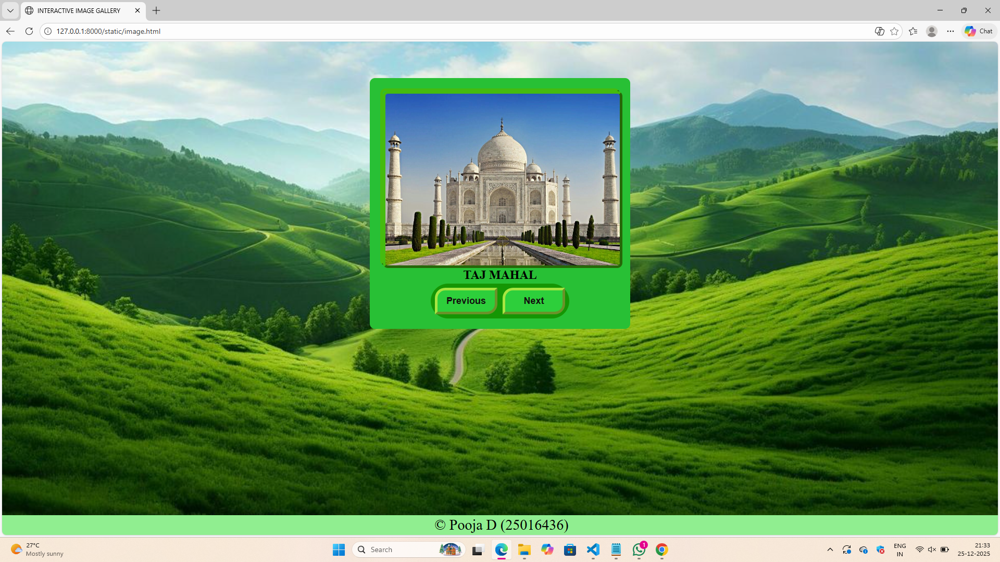
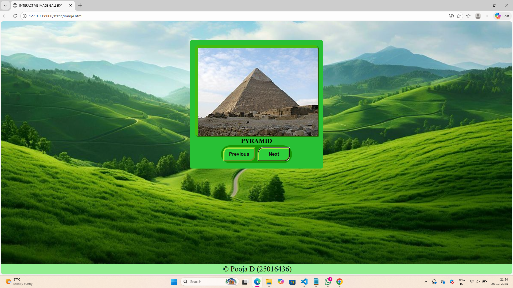
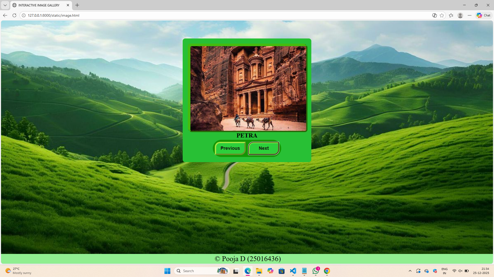
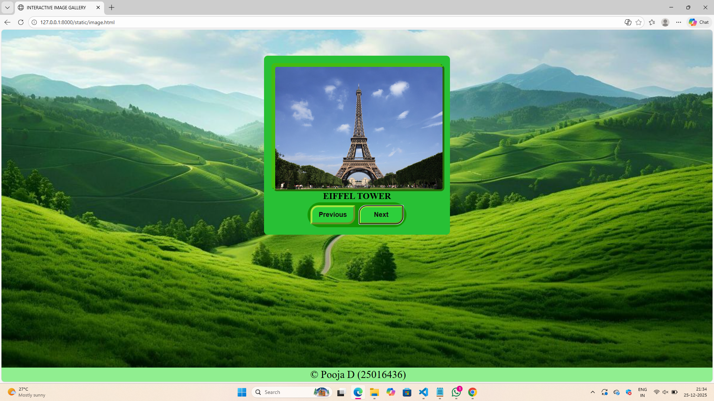

# Ex.07 Design of Interactive Image Gallery
## Date:26.12.25

## AIM:
To design a web application for an inteactive image gallery for a minimum five images with next and previous buttons.

## DESIGN STEPS:

### Step 1:
Clone the github repository and create Django admin interface.

### Step 2:
Change settings.py file to allow request from all hosts.

### Step 3:
Use CSS for positioning and styling.

### Step 4:
Write JavaScript program for implementing interactivity.

### Step 5:
Validate the HTML and CSS code.

### Step 6:
Publish the website in the given URL.

## PROGRAM:
```
image.html

<html>
    <head>
        <title>INTERACTIVE IMAGE GALLERY</title>
        <link rel="stylesheet" href="image.css">
        <script src="image.js"></script>
    </head>
    <body>
         <div class="GALLERY">
            
            <div class="imgbox">
                
                <div class="about" id="about">
                    <b>TAJ MAHAL</b>
                </div>
            </div>

            <div class="buttons">
                <button onclick="prev()">Previous</button>
                <button onclick="nex()">Next</button>
            </div>

            <div class="footer">
                <p>
                    &copy; Pooja D (25016436)
                </p>
            </div>
         </div>
    </body>
</html>

image.css

body
{
    background: url('bk.png')no-repeat bottom / cover;
}
.GALLERY
{
    display:flex;
    justify-content: center;
    align-items: center;    
    background-color: rgb(40, 192, 53);
    width: fit-content;
    padding:20px;
    margin: 70px auto; 
    flex-direction: column;
    border-radius: 10px;
    border-right:rgb(140, 233, 111);
    border-bottom:rgb(131, 216, 98);
}

.topic {
    font-size: 20px;
}

.imgbox, img
{
    width:450px;
    height:330px;
    object-fit: cover;
    border-radius: 10px;
    border: outset rgb(69, 187, 15) 5px;
}
.about
{
    text-align: center;
    font-size: 24px;
    font-weight: bold;
    color: rgb(24, 22, 24) 5px;
    
}
.buttons
{
    display: flex;
    gap: 10px;             
    margin-top: 35px;
    background-color: rgb(21, 150, 4); 
    padding: 8px;
    border-radius: 60px;
   
}
button
{
    width: 120px;
    padding: 10px;
    font-size: 18px;
    font-weight: bold;
    background-color: rgb(45, 207, 59);
    color: rgb(18, 15, 15);
    border: none;
    border-radius: 20px 0px 20px 0px;
    cursor: pointer;
    border: outset rgb(167, 230, 65) 5px;
}

.footer p
{
    position:fixed;
    background-color: lightgreen;
    left:0;
    bottom:0;
    width:100%;
    color: black;
    text-align: center;
    font-size: 28px;
    padding: 3px;
    margin-bottom: 0px;
}

image.js

var img = [
{image:"taj.png", about:"TAJ MAHAL"},
{image:"pyramid.jpg", about:"PYRAMID"},
{image:"petra.png", about:"PETRA"},
{image:"tower.png", about:"EIFFEL TOWER"}
];

var index=0;
function nex()
{
    index++;
    if(index >= img.length)
        index=0;
    document.getElementById("image").src=img[index].image;
    document.getElementById("about").innerHTML =img[index].about;
}

function prev()
{
    index--;
    if(index <0)
        index=img.length-1;
    document.getElementById("image").src=img[index].image;
    document.getElementById("about").innerHTML =img[index].about;
}


```

## OUTPUT:





## RESULT:
The program for designing an interactive image gallery using HTML, CSS and JavaScript is executed successfully.
